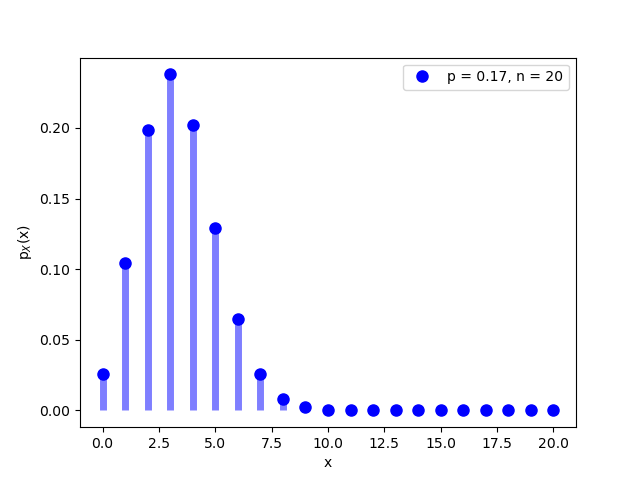
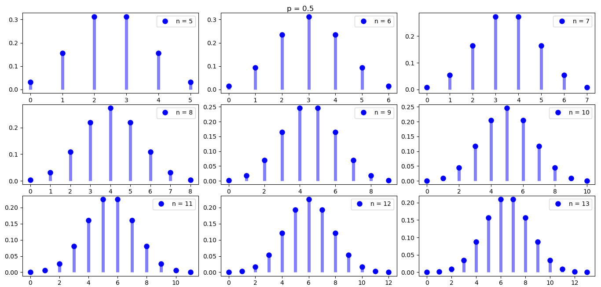

Unos amigos juegan con un par de dados. Los tiran n veces y gana quien acierte cuantas veces van a sumar 7.
¿Cuántas veces deberían tirar los dados para que lo más probable fuera ganar jugándole a que sale 10 veces?

La distribución es bimodal para n = 59 y n = 65. Para estos se cumple que $(n+1)p \in \N $. Para $ n \in {60, 61, 62, 63, 64} $ la distribución es unimodal.

Para $p \neq 0.5$ y $n$ pequeño, la distribución binomial no es simétrica. 

Para $p = 0.5 $ se recupera la simetría del combinatorio pues $B(r;n,0.5) = \binom{n}{k}$
