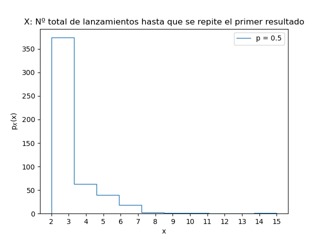
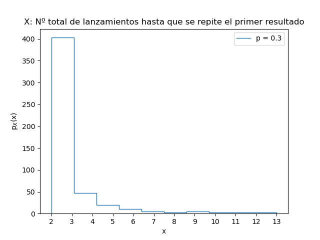

Se lanza repetidamente una moneda cargada hasta que el primer resultado vuelve a aparecer. Muestre que:

(a) La probabilidad de que el juego termine en el lanzamiento n + 2 es $P_{n} = p^{2}q^{n} + q^{2}p^{n}$, donde p es la probabilidad de que salga cara y q = 1 − p.

(b) $P_{n}$ permite definir una función que a cada subconjunto de A ⊆ N le asigna una probabilidad. Defínala y muestre que satisface las tres propiedades de una medida de probabilidad (si el primer intento de
definición no las satisface, modificar la definición para que sí lo haga).

(c) La probabilidad de que el juego dure más de n + 2 lanzamientos es $qp^{n+1} + pq^{n+1}$.

(d) Si p = 0 o p = 1 habrá sólo dos tiradas, y en otro caso el número esperado de tiradas es siempre 3. ¿El resultado en este último caso depende del valor de p?

(e) Muestre que si bien la duración promedio del juego es siempre 3 tiradas (para todo valor de p, salvo p=0 o p=1), una moneda pareja (p=0.5) maximiza la probabilidad que el juego dure más de 4 tiradas.

Valor medio muestral = 3.04

Valor medio muestral = 2.894

Código:G2_4_monedacargada.py
